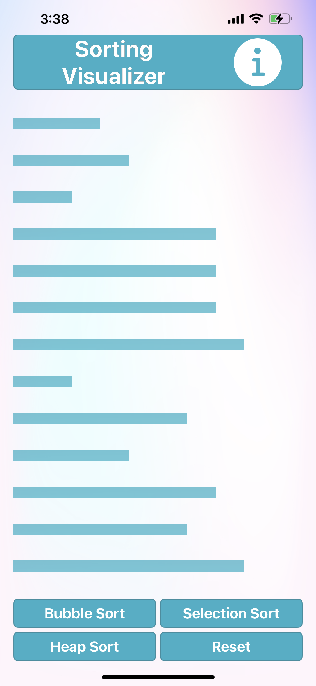
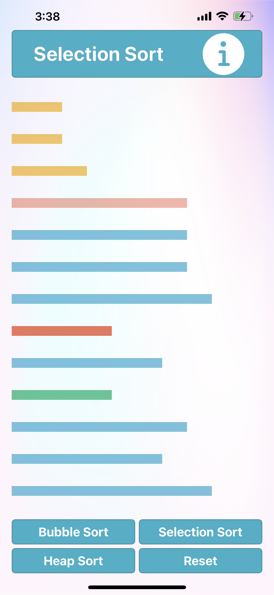
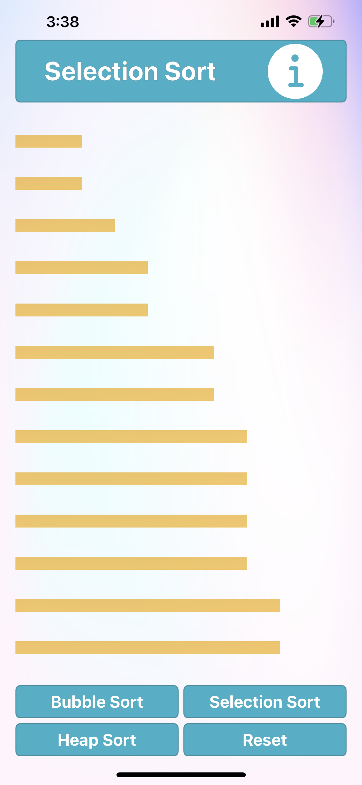
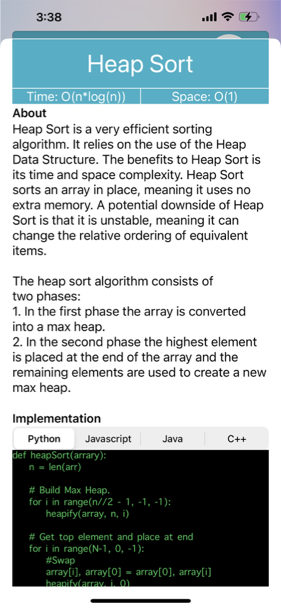
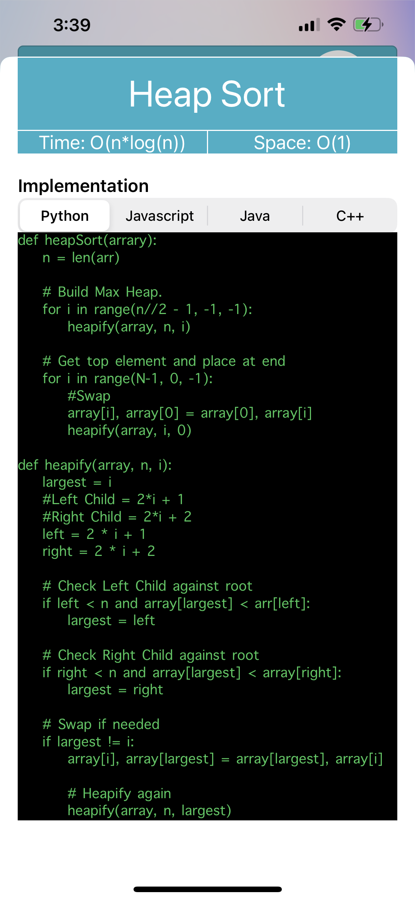
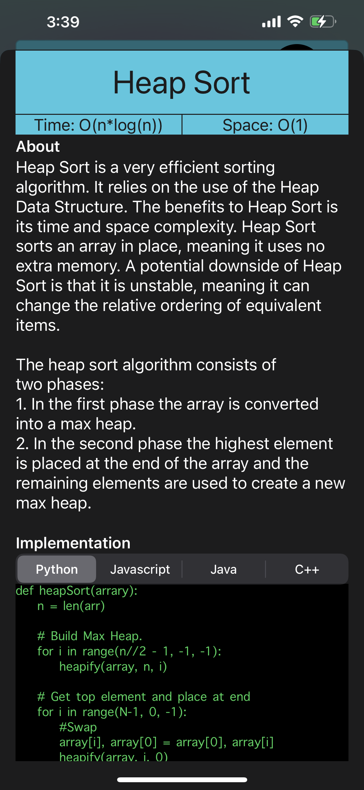

# Sorting Visualizer for IOS
This IOS application allows developers to have a step-by-step visualization of three (and counting) sorting algorithms: Heap Sort, Selection Sort, and Bubble Sort. 
This application also provides developers with key information regarding each algorithm such as time/space complexities, implementations in 4 languages and a description in order to help them better understand the algorithms.
This application also supports Dark Mode for all the late night coding sessions. 

# Built Using
Swift, XCode
 
# Screenshots

